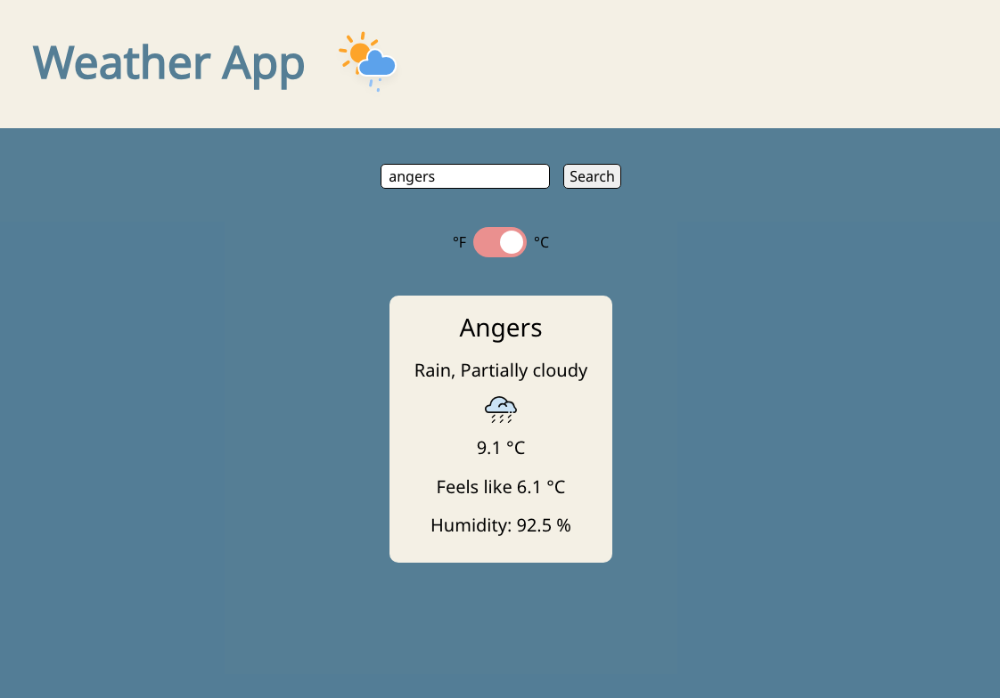

# odin-weather

Weather App project from **The Odin Project**. Get the current weather for any city in the world (with unit conversion °F/°C).

[live demo](https://evicno.github.io/odin-weather/)

## Built with

- **Asynchronous programming**: async/await, promises, dynamic import
- **API**: Virtual Crossing

## Credits

Header icon by <a href="https://www.amcharts.com/free-animated-svg-weather-icons/" target="_blank">AM Charts</a>

Weather Icons by <a href="https://github.com/visualcrossing/WeatherIcons/tree/main" target="_blank">Virtual Crossing</a>
